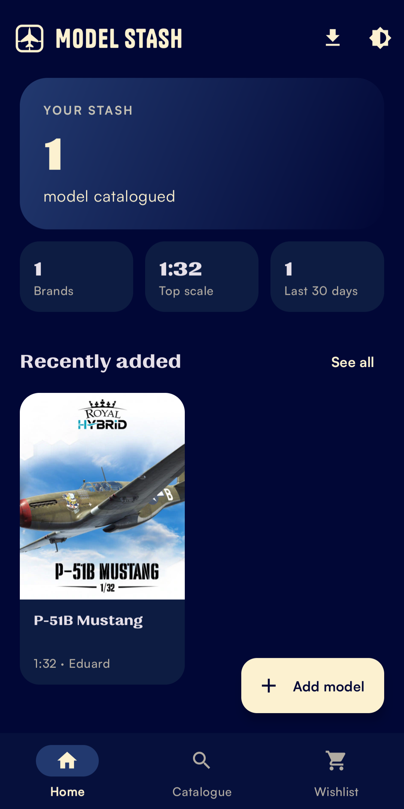
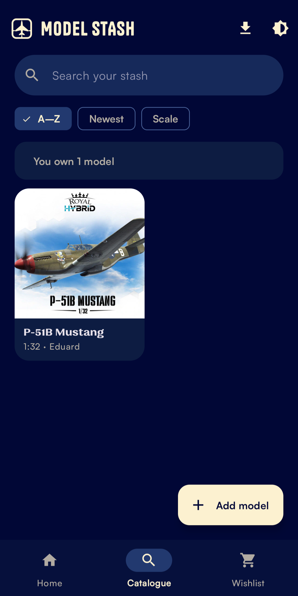
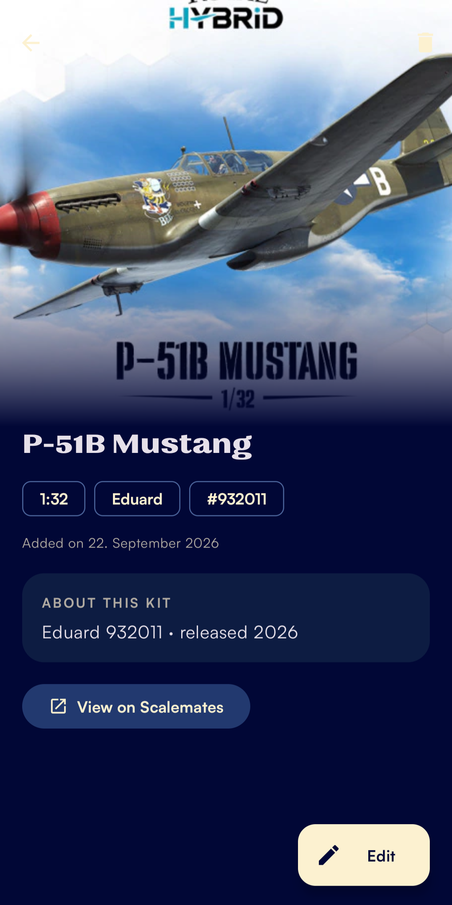
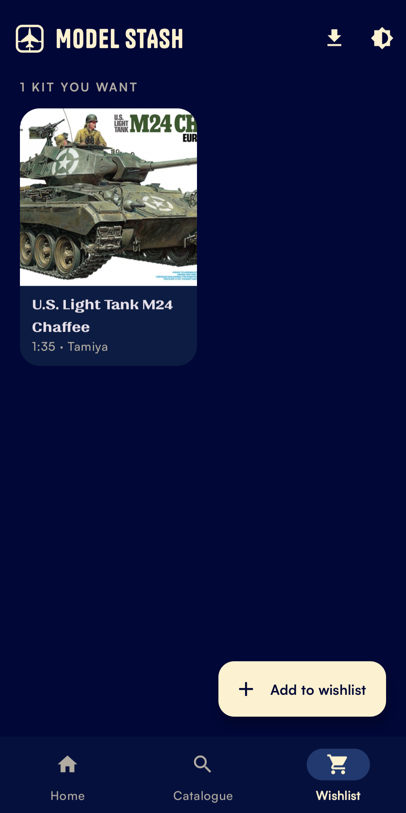
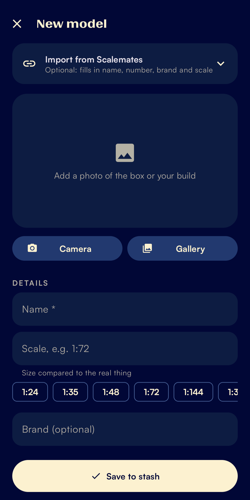
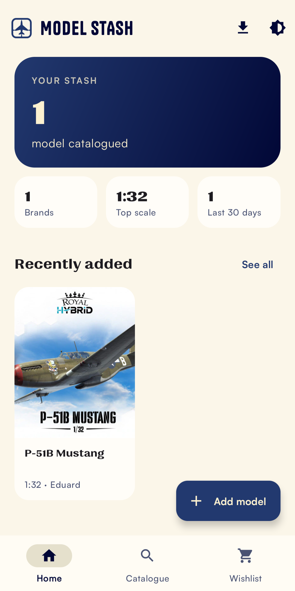

# Model Stash

An Android app for keeping track of the scale model kits you own — and the ones you still want.

Built because "do I already have this one?" is a hard question to answer while standing in a hobby shop.

## Screenshots

<table>
  <tr>
    <td align="center"><br><sub>Dashboard</sub></td>
    <td align="center"><br><sub>Catalogue &amp; search</sub></td>
    <td align="center"><br><sub>Kit detail</sub></td>
  </tr>
  <tr>
    <td align="center"><br><sub>Wishlist</sub></td>
    <td align="center"><br><sub>Adding a kit</sub></td>
    <td align="center"><br><sub>Light theme</sub></td>
  </tr>
</table>

## Features

**Catalogue** — every kit you own, as a photo grid. Each kit holds a name, scale, brand, kit number, a description and a photo. Sort by name, by newest, or by scale.

**Search that answers the actual question** — type a name or a kit number and the screen says plainly whether you own it: *You own "Spitfire Mk.I"*, *You don't own it yet*, or *3 models match*. If you don't own it, a button takes you straight to the add form with the name already filled in. Search runs against names and kit numbers, so `32571` finds a kit just as well as its name does.

**Wishlist** — a second list for kits you want to buy, kept apart from what you own. Same add flow, same fields. When you actually buy one, a single button moves it into your catalogue with its photo and notes intact.

**Dashboard** — how many kits you own, how many brands, your most common scale, how many you added in the last 30 days, and a carousel of the newest ones.

**Photos** — camera or gallery, stored in the app's own private folder so they never clutter your camera roll. Tapping a card grows its photo into the detail screen's header.

**Scalemates import** — paste the link to a kit page and the app fills in the name, kit number, brand and scale. Sharing a link from your browser opens the same form, already filled in. Everything is optional: you can type every field by hand, which matters for small-manufacturer kits that aren't listed anywhere.

**CSV import** — bulk-add a list you already keep in a spreadsheet.

**Light and dark** — dark by default, light if you prefer, or follow the system. Switchable from the toolbar.

## Importing a CSV

Four columns are read; everything else in the file is ignored.

```
name,number,brand,scale
Russian Heavy Tank JS-2 Model 1944 ChKZ,32571,Tamiya,1:48
IJN Battleship Mikasa (Full Hull Special),CH128 (64128),Hasegawa,1:700
Yamashiro 1944 full hull with metal barrel,,Aoshima,
```

- Only `name` is required — a row with an empty number, brand or scale is still imported.
- A header row maps the columns, so they can be in any order. Common spellings are understood: `Kit No.`, `Kit number`, `Model number`, `Manufacturer`, `Maker`, `Ratio`, `Size`. Without a header, the order above is assumed.
- Scales are normalised: `72`, `1/72` and `1:72` all become `1:72`. Anything that isn't a scale is left empty rather than rejecting the row.
- Quoted fields, semicolon separators (as German Excel writes them), Windows line endings and a leading byte-order mark all work.
- Which list gets filled follows the tab you're on — import from the Wishlist tab and the rows land there.
- An import always adds; it never overwrites and never deletes.

## How the Scalemates import works

Scalemates has no public API, and its `robots.txt` asks automated tools to stay out of search. So the app doesn't crawl it and never goes looking for a kit on its own.

What it does instead is fetch exactly one page — the kit URL you paste or share — on a background thread, identifying itself honestly in the User-Agent. `ScalematesParser` reads the `og:title` meta tag for the kit name and the meta description for the brand, kit number, scale and release year, decoding HTML entities as it goes. Everything it finds lands in the form as editable text, so a wrong guess costs you one correction rather than a bad record.

Only kit URLs (`scalemates.com/kits/…`) are accepted; anything else is rejected with a message rather than fetched.

## Architecture

One activity hosting three fragments for the tabs, plus two activities for the flows that deserve their own screen.

```
MainActivity ─ DashboardFragment    stats + recently added
             ├ CatalogueFragment    search + grid of kits you own
             └ WishlistFragment     grid of kits you want

AddEditModelActivity   add or edit, Scalemates fetch, photos
ModelDetailActivity    one kit, collapsing photo header, delete / edit / move
```

**Data** — Room with a single `models` table. A `wishlist` boolean decides which list a kit belongs to, which is what makes moving between them a one-field update rather than a copy. Schema changes ship as real migrations (`1→2` added the wishlist flag, `2→3` the kit number), so updating the app never wipes what's on the phone. All writes go through `ModelRepository` onto a fixed thread pool; the UI never touches the database directly.

**State** — `MainViewModel` exposes LiveData for the counts, the recent list, the wishlist and the search results. The search query feeds a `switchMap` so typing re-queries the database rather than filtering in memory, and the sort order is layered on with a `MediatorLiveData`. Because the view model is scoped to the activity, switching tabs keeps your search and sort.

**Lists** — `ListAdapter` with a `DiffUtil` callback, so inserts and edits animate instead of blinking. The dashboard carousel uses a `LinearSnapHelper`; the grids use a staggered enter animation.

**Transitions** — tapping a card runs a shared-element transition into the detail screen. The enter transition is postponed until Glide reports the photo is decoded, so the animation starts from a real image rather than an empty frame.

**Theming** — one `DayNight` theme with the palette split across `values/colors.xml` and `values-night/colors.xml`, so light and dark are the same layout with different tokens. The saved preference is applied in `ModelStashApp.onCreate` via `AppCompatDelegate`, before the first activity inflates, which avoids the flash of the wrong theme on launch. Typography is set through `textAppearance*` theme attributes rather than a blanket `fontFamily`, so each text style keeps its own typeface.

**Edge-to-edge** — the app draws behind the system bars and applies insets per screen through a small `InsetsHelper`, so the FABs sit above the navigation bar and scrolling content clears the status bar.

**Photos** — the camera path writes through a `FileProvider` into app-private storage, so no storage permission is needed. Replaced and abandoned photos are deleted when you leave the form, and a kit's photo is deleted with the kit.

## Project layout

```
app/src/main/java/com/sarthak/modelstash/
├── MainActivity.java          tabs, toolbar, CSV import, theme switching
├── ModelStashApp.java         applies the saved light/dark preference at startup
├── data/                      ModelKit entity, DAO, database + migrations, repository
├── scalemates/                single-page fetcher and its HTML parser
├── ui/                        fragments, activities, list adapter, view model
└── util/                      scale formatting, CSV parsing, photo storage, stats, sorting
```

## Tests

The logic that doesn't need a device lives in plain Java classes and is unit-tested: scale normalisation, CSV parsing, the Scalemates HTML parser, sorting and the dashboard stats.

```
./gradlew test
```

## Tech stack

- Java, minSdk 26 (Android 8.0), Material 3
- Room, ViewModel, LiveData, Fragment, RecyclerView
- Glide for image loading
- AndroidX Core SplashScreen
- Tanker, Quilon and Satoshi ([Fontshare](https://www.fontshare.com))

## Building it

1. Clone the repo and open it in Android Studio.
2. Let Gradle sync — dependencies come from Google's Maven repository and Maven Central.
3. Run on a device or emulator, API 26 or newer.

For an installable build: **Build → Generate Signed App Bundle / APK → APK**, create or pick a keystore, and choose the `release` variant. Keep the `.jks` file and its passwords — without them you can't ship an update that installs over the previous one.

## Privacy

No accounts, no analytics, no telemetry. The only network request the app ever makes is the Scalemates page fetch you explicitly trigger. Your kits, notes and photos stay on the phone and are covered by Android's automatic backup.